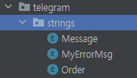

# Stock Helper

# 구현 계획중인 기능 목록
- 기능A에 시가총액 추가
- 석인이 말한 차트특징? 뭔 신호? 그런거 만족했나 알려주기
- 성능개선 / STOCK_SEARCH / !!{주식이름} 검색 속도 개선
  - 일정시간마다 전체 주식 리스트 작성하여 갖고있기
- (기능B)-  db랑 연동해서 사용
  - 유저별 거를 리스트 생길거 고려 (유저에 외래키로 거를리스트 idx 넣음 될듯?)
    - 유저 개발할 때 개발하면 되니까 이거 만들 때는 안 해도 될 것 같다는 뜻
- Bean에 대해 이해하여 Bean화 할 수 있는 것들 Bean화 하기

# 구현이 완료된 기능 목록

- ### [기능B]StockFinder.getStocks() 구현 -- 주식 전체 종목 정보 리스트 만드는 기능
  
  - (기능B)에 거를 종목 키워드 추가(2023.01.26)
    - trash=[인버스,블룸버그,'ETN','선물','HANARO','KBSTAR','TIGER','KOSEF','KINDEX','ARIRANG','KODEX','SMART']
  
- ### [기능C]상승률 n% 거래대금 m억 이상인 종목 찾기
  
  > ### - 스프링 스케줄러
  
  - (기능B) 활용
  
  - 2023-01-30: 상승률순 정렬에서 이름순 정렬로 변경
  
  - 특정 시간마다 알려줌
  
    - 코드(특징 = n% m억에 대해 상수 제거)
  
      ```java
          @Scheduled(cron = "0 0 12,18 * * *") //0초 0분 12시, 18시 매일 매월 매년
          public void autoHotAlert() throws TelegramApiException {//오늘의 HOT 주식 자동 알림 
              // stockFinder.setTempStock(stockFinder.getStocks());
              log.info("자동생성 리스트");
              List<String> stockStrings = stockFinder.makeTodayHotStock(RISE_RATE_FOR_SCHEDULE.getNum(), HUNDRED_MILLION_FOR_SCHEDULE.getNum());
              String timeText = dateFormat.format(new Date())+Message.ALERT_SOMETHING.getMsgFormat();//시간 + 입니다.
      
              String todayHotStockMsgHeaderAuto = String.format(//<오늘의 자동알림 HOT %d%, %d억>
                      TODAY_HOT_STOCK_MSG_HEADER_AUTO.getMsgFormat(),
                      RISE_RATE_FOR_SCHEDULE.getNum(),HUNDRED_MILLION_FOR_SCHEDULE.getNum()
              );
      
              String listToMsg = myConverter.listToMsg(stockStrings);
              echoBot.execute(SendMessage.builder()
                      .text(timeText + todayHotStockMsgHeaderAuto + listToMsg)//리스트를 \n 구분 스트링으로
                      .chatId(STOCK_SEARCH.getChatId())
                      .build());
      
          }
      ```
  
      

* ### [기능A]주식정보검색: input: 주식이름 —> output: 주식상세
  
  * (기능A)에 {per, 순위} 추가
  * (기능A)에 {오늘의 상승률 순위} 추가
  * (기능A)에 {오늘의 거래대금 순위} 추가
  * (기능A)에 없는 종목 검색시 예외처리
  * ~~ (기능A)에 여러종목이 검색되는 이름 입력시 맨 처음 등장하는 주식에 대한 정보 리턴 처리~~ 
    * 웹크롤링에서 api사용으로 바꾸면서 현재 사용하지 않음

# 시스템 개선

## 노트북에 개발 환경 설정

- 일단 파이썬 개발환경 세팅
- 브랜치 나눠놨고
- cybos plus 설치 및 노트북에서 사용 가능하도록 공인인증서 휴대폰에 구비할 것

## 문자열 모아서 관리



* 문자열 관리 예시(에러관련)

  ```java
    package com.example.stock_helper.telegram.strings;
    
    import lombok.Getter;
    
    @Getter
    public enum MyErrorMsg {
        NO_STOCK_NAME_ERROR("존재하지 않는 주식명: [%s]"),
        DISCONNECT_MAYBE("연결 끊김 의심");
    
        MyErrorMsg(String msgFormat){
            this.msgFormat = msgFormat;
        }
        private String msgFormat;
    }
  ```

* 오류 발생시 

  ```java
    catch(RuntimeException e){//에러메시지를 하드코딩하는 대신 enum을 호출하여 사용
                if (e.getMessage().equals(String.format(MyErrorMsg.NO_STOCK_NAME_ERROR.getMsgFormat(),stockName))){
                    return String.format(Message.NOT_EXIST_STOCK_NAME.getMsgFormat(),stockName);
                }
                return MyErrorMsg.DISCONNECT_MAYBE.getMsgFormat();
            }
  ```

  

## 기능별 변수 동기화


​      

위처럼 개별 변수로 존재하던 주식 종목 관련 요청 필드를

아래와 같이 하나의 파일에서 관리하여 파일 하나만 수정하면 전체 프로그램에 적용되도록 변경함


# 디버깅 해야하는 목록
  - 일정 기간이 지나면 cybos plus5가 꺼짐 (2023-01-25)
    - cybos plus가 꺼지면 있는 주식도 잘못된 주식명이라고 나옴
      - 잘못된 주식명 대신 cybos가 꺼져있다고 출력
    - cybos가 꺼지면 자동으로 재시작
# 해결된 디버깅{원인}{해결방법}

- Cybos 자동 꺼지는 문제 해결

  #### #원인 : cybos는 실행 후 24시간이 지나면 자동 종료됨

  #### #해결방법

  1. ProcessBuilder 사용하여 cybos 실행 파일 CpStarter.exe를 실행하여 해결

     ``` java
     String[] command = new String[] {"C:\\DAISHIN\\STARTER\\ncStarter.exe","/prj:cp","/id:"+id,"/pwd:"+pwd,"/pwdcert:"+pwdcert, "/autostart"};
     
     Process process = new ProcessBuilder(command).start();
     ```

     

2.  이미 cybos가 실행중인 경우 기존 프로세스를 종료할지 묻는 Confirm창이 떠서 자동으로 진행되지 않는 문제 발생

   1. guiController.py= confirm창이 뜨면 자동으로 예를 누르는 파이썬 프로그램 작성
   2. Cybos 자동 실행 코드 맨 뒤에 guiController.py를 실행하는 코드 추가
      - python script를 실행하는 코드(ReadPython.java)

3. 컴퓨터 환경에 따라 Confirm창이 뜨기 전에 파이썬 스크립트가 실행되는 문제 발생

   > 파이썬 스크립트는 실행시점에 Confirm창이 있나 확인하기 때문에 Confrim창이 늦게 뜨면 없는 것으로 판단하고 종료됨

   1. n초 동안 n번 확인하고 종료하는 로직으로 변경

      ```python
      flag = False
      for sec in range(waitMax):
          conFirmExist = imgExistWithConfidence(confirm_exit_cp,0.95)['exist'] #Confirm창 존재함
          if conFirmExist:
              # print(conFirmExist)
              mouseToImgAndClick(confirm_exit_cp_yes,0.95) #확인버튼 클릭
              flag = True #Confirm 종료
              break
          time.sleep(1)
          
      if flag:
          print('기존 프로그램 종료')
      else:
          print('기존 프로그램 없음')
      ```

      

---


- 8글자에서 주식명 끊기는 문제

  ```
  8글자에서 주식명 끊기는 문제 해결완료 상세>>
  
  1. 전체 주식 종목 훑는 api에 글자수 제한 있었음
  2. 전체주식 리스트를 만들고
  3. 해당 리스트에 담긴 코드를 이용하여
  4. 각 주식의 이름을 이름제한이 없는 api로부터 불러와 수정함
  ```

- 신규상장주 검색 되지 않는 문제

  - 원인: 종목['상승률'] 계산에서 어제 가격이 0이라 division by zero 발생
  - 해결방법: 어제 가격이 0이면 어제 가격대신 오늘 시가로 계산하도록 변경

* 종목명에 공백이 있으면 검색되지 않는 문제

  * 해결방법과 원인

    #### #원인

    ```PYTHON
    def main(args):
        # Do some processing with the arguments
    
        # Return the result
        #터미널에서 python 프로그램 실행할 때 ~~.py arg1 arg2 이런식인데
        stock_name = args[0] #이 부분 때문에 공백있는 종목은 공백 앞부분만 들어감
    
        result = getDetail(stock_name)
        return result
    
    if __name__ == "__main__":
        result = main(sys.argv[1:])
        result = json.dumps(result)
        print(result)
    
    ```

    #해결방법

    ```python
    def main(args):
        # Do some processing with the arguments
    
        # Return the result
        
        stock_name = " ".join(args) #args를 " ".join을 이용해 원래 종목명으로 변환
        # print(stock_name,'test stock')
        result = getDetail(stock_name)
        return result
    
    if __name__ == "__main__":
        result = main(sys.argv[1:])
        result = json.dumps(result)
        print(result)
    
    ```

    

* 주식정보검색에서 /start를 매번 입력해야 하는 문제
  {텔레그램 방에서 봇한테 메세지 권한을 줘야함}

- 파이썬 출력 읽을 때 파일 깨짐
